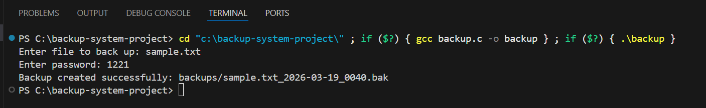
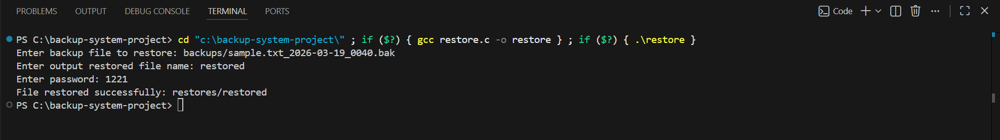
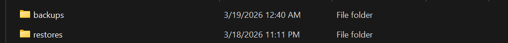

# 🔐 Secure Backup System in C

## 📌 Motivation

In March 2025, a 7.7 magnitude earthquake in Myanmar caused a fire at Mandalay University, which destroyed my final matriculation exam papers. That experience made me realize how fragile data can be and how important it is to have reliable backup systems.

This project was inspired by that experience. I wanted to build a simple system that could protect important files and allow them to be recovered safely.

---

## 💡 Project Overview

This is an educational secure backup prototype written in C that allows users to:
- Back up files
- Encrypt them using a password
- Store multiple versions using timestamps
- Restore files when needed
- Verify passwords before restoring

The goal of this project was to understand how data protection systems work at a low level using file handling in C.
This project simulates a basic secure backup system and demonstrates fundamental concepts in cybersecurity and data protection.

---

##▶️How to Run

Make sure you are inside the project folder before running the commands.

### 1. Compile the programs

```gcc backup.c -o backup```
```gcc restore.c -o restore```

### 2. Run backup

```./backup```

Enter:
- File name (e.g. sample.txt)
- Password

### 3. Run restore

```./restore```

Enter:
- Backup file path (e.g. backups/sample.txt_YYYY-MM-DD_HHMM.bak)
- Output file name (e.g. restored.txt)
- Password

---

## 🛠️ Features

- 🔒 **Password-based encryption (XOR)**
  - Files are encrypted using a user-provided password

- 🕒 **Timestamped backups**
  - Each backup file includes date and time to avoid overwriting and allow version tracking

- ✅ **Password verification**
  - Prevents restoring files with an incorrect password

- 📂 **Organized file structure**
  - Backups are stored in a `backups/` folder  
  - Restored files are saved in a `restores/` folder  

- 📝 **Backup logging**
  - Each backup action is recorded in a log file

---

## 📁 Project Structure

```secure-backup-system-c/
│
├── backup.c
├── restore.c
├── backups/
├── restored/
└── README.md
```

---

## 🧪 Test Cases

### Test Case 1: Backup File
- Input: `sample.txt`2
- Password: `1221`
- Expected Result: Backup file created in `backups/` with timestamp

### Test Case 2: Restore with Correct Password
- Input: Valid backup file  
- Password: `1221`  
- Expected Result: File restored successfully and matches original  

### Test Case 3: Restore with Incorrect Password
- Input: Valid backup file  
- Password: Wrong password  
- Expected Result: Error message shown and no file restored  

### Test Case 4: File Integrity Check
- Compare original and restored file  
- Expected Result: Files are identical  

---

## 🧪 Example Output

Backup created successfully: backups/sample.txt_2026-03-18_2249.bak
File restored successfully: restored/restored.txt

---

## 🧠 What I Learned

Through this project, I learned:
- How file handling works in C  
- How basic encryption can be implemented  
- How to design a system that handles real-world problems  
- The importance of versioning and data recovery  
- How small improvements (like password verification and timestamps) make a system more reliable  

---

## ⚠️ Limitations

This project uses XOR-based encryption, which is not secure for real-world applications. It was implemented as a learning exercise.

---

## 🚀 Future Improvements

- Implement stronger encryption (e.g. AES)
- Add automatic scheduled backups  
- Support backing up entire folders  
- Integrate with cloud storage systems  

---

## 👨‍💻 Author

**Aung Khant Paing**

Prospective cybersecurity student with a strong interest in data protection, system resilience, and disaster recovery.


## 📸 Screenshots

### Backup Process


### Restore Process


### Project Structure

